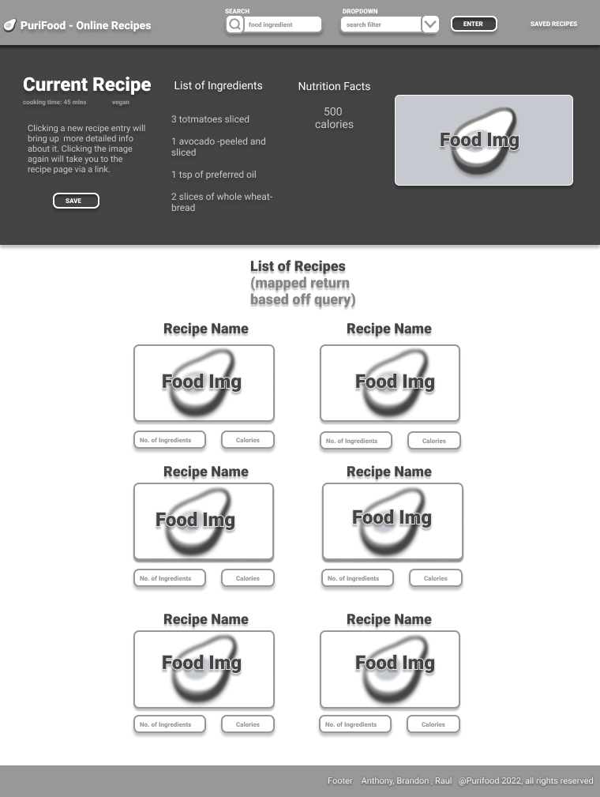

# PuriFood 🍖🥑🍉

## Table of contents 📒

- [Description](#description)
- [Features](#features)
- [ERD](#erd)
- [APIs Server Routes](#apis-server-routes)
- [Wireframes](#wireframes)
- [Component Hierarchy](#component-hierarchy)
- [Dependencies](#denpendencies)
- [Installation](#installation)

## Description

- **What is PuriFood**: PuriFood is a tool that allows a health conscious
  person to find & share healthy recipes. Users can save
  their favorite recipes, while also creating their own.
  They can view the receipe's & the ingredient's
  nutritional facts. They will be able to search for
  receipes not just by recipe type but by filtering for
  specific food.
- **MVP**: PuriFood users will be able to create their own
  recipes and store them onto their MongoDB database.
  Once created, the user will be able to delete and
  update their recipes.
- **Post MVP**: PuriFood Users will be able to save recipes
  from the EDAMAM API into their database. A user will
  be able find similar recipes based on categories,
  country of origin, or ingredients. For the mobile
  version, they will be able to add ingredients from
  the recipes into a shopping list.

## Features

- **Search for Recipes by Ingredients**
- **Create Recipes**
- **Edit Recipes**
- **Delete Recipes**
- **Save Favorite Recipes**

## ERD

## Backend Server Routes

## Wireframes

## Component Hierarchy

    code
    .
    │
    ├── src
    │   ├── components
    │   │   ├── Footer.jsx
    │   │   ├── Layout.jsx
    │   │   ├── NavigationBar.jsx
    │   │   ├── RecipeForm.jsx
    │   │
    │   ├── pages
    │   │   ├── CreateRecipe.jsx
    │   │   ├── EditRecipe.jsx
    │   │   ├── FindRecipes.jsx
    │   │   ├── HomePage.jsx
    │   │   ├── MyRecipes.jsx
    │   │   ├── RecipeInfo.jsx
    │   │
    │   ├── routes
    │   │    ├── Routes.jsx
    │   │
    │   ├── services
    │   │    ├── apiCalls.js
    │   │
    │   ├── App.css
    │   │
    │   ├── App.js
    │   │
    │   ├── index.js

## Dependencies

- [NodeJS](https://nodejs.org/en/)
- [Axios](https://github.com/axios/axios)
- [Cors](https://www.npmjs.com/package/cors)
- [MongoDB](https://www.mongodb.com/)
- [Mongoose](https://www.npmjs.com/package/mongoose)
- [Morgan](https://www.npmjs.com/package/morgan)
- [Nodemon](https://www.npmjs.com/package/nodemon)
- [React Hooks](https://reactjs.org/docs/hooks-intro.html)
- [React Router](https://v5.reactrouter.com/web/guides/quick-start)

### FrameWorks

- [ReactJS](https://reactjs.org/)
- [Express](https://expressjs.com/en/starter/installing.html)
- [Material UI](https://mui.com/)

### APIs

- [Edamam API](https://www.edamam.com/)

## Installation

**Step 1: Clone Blog Repo**

Using your terminal(Mac OS) cd into a directory you want to
clone the repo at. Copy the repo URL and run the following command
in the terminal

        git clone https://github.com/tapia81/puriFood.git

**Step 2: Install Dependencies**

From your terminal cd into repo and type:
    npm i axios cors mongoose nodemon express morgan

**Step 3: Setup .env Files**

(must have an api id/key from Edamam API, see reference above)
In your repo, create a files named .env inside of the src/ directory and type this inside of it and save it:
    REACT_APP_EDAMAM_RECIPE_ID_KEY=<your-id-key>
    REACT_APP_EDAMAM_RECIPE_API_KEY=<your-api-key>

**Step 4: Run React App**
From your terminal (while inside of your project/repo folder) run the following command:

      npm start